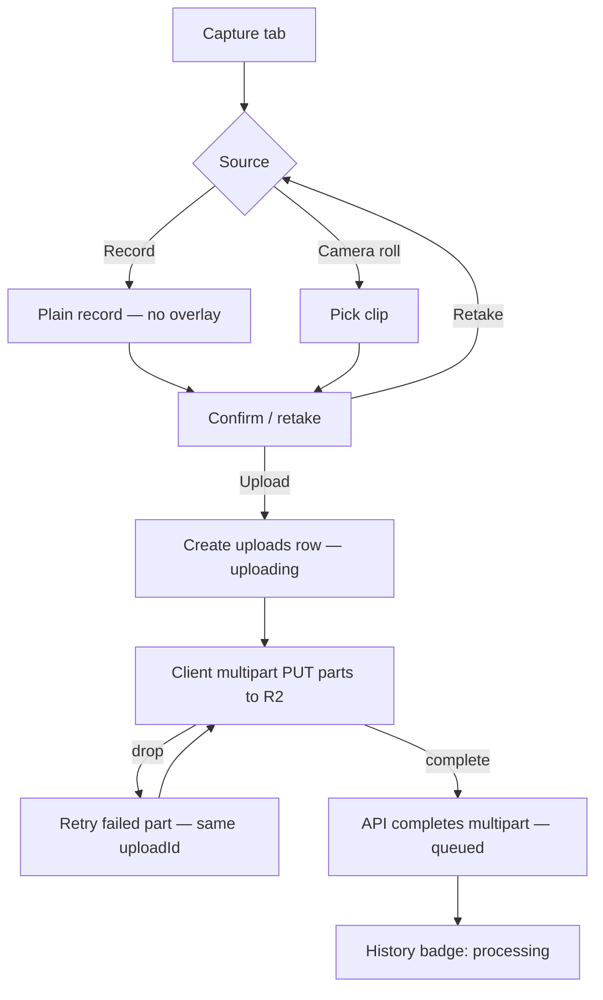

# Activity — capture / upload

```mermaid
flowchart TD
  start[Capture tab] --> src{Source}
  src -->|Record| rec[Plain record — no overlay]
  src -->|Camera roll| pick[Pick clip]
  rec --> confirm[Confirm / retake]
  pick --> confirm
  confirm -->|Retake| src
  confirm -->|Upload| row[Create uploads row — uploading]
  row --> mp[Client multipart PUT parts to R2]
  mp -->|drop| resume[Retry failed part — same uploadId]
  resume --> mp
  mp -->|complete| queued[API completes multipart — queued]
  queued --> hist[History badge: processing]
```
