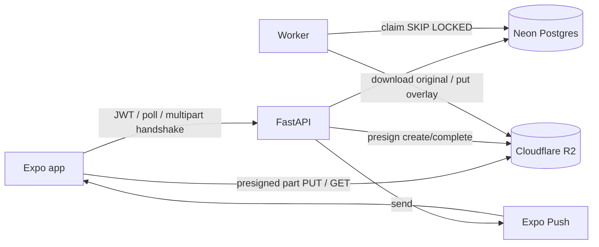

# Component

```mermaid
flowchart LR
  App[Expo app]
  API[FastAPI]
  W[Worker]
  PG[(Neon Postgres)]
  R2[(Cloudflare R2)]
  Push[Expo Push]

  App -->|JWT / poll / multipart handshake| API
  App -->|presigned part PUT / GET| R2
  API --> PG
  API -->|presign create/complete| R2
  API -->|send| Push
  Push --> App
  W -->|claim SKIP LOCKED| PG
  W -->|download original / put overlay| R2
```
