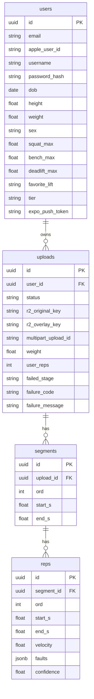

# ER — data model

```mermaid
erDiagram
  users ||--o{ uploads : owns
  uploads ||--o{ segments : has
  segments ||--o{ reps : has

  users {
    uuid id PK
    string email
    string apple_user_id
    string username
    string password_hash
    date dob
    float height
    float weight
    string sex
    float squat_max
    float bench_max
    float deadlift_max
    string favorite_lift
    string tier
    string expo_push_token
  }

  uploads {
    uuid id PK
    uuid user_id FK
    string status
    string r2_original_key
    string r2_overlay_key
    string multipart_upload_id
    float weight
    int user_reps
    string failed_stage
    string failure_code
    string failure_message
  }

  segments {
    uuid id PK
    uuid upload_id FK
    int ord
    float start_s
    float end_s
  }

  reps {
    uuid id PK
    uuid segment_id FK
    int ord
    float start_s
    float end_s
    float velocity
    jsonb faults
    float confidence
  }
```
