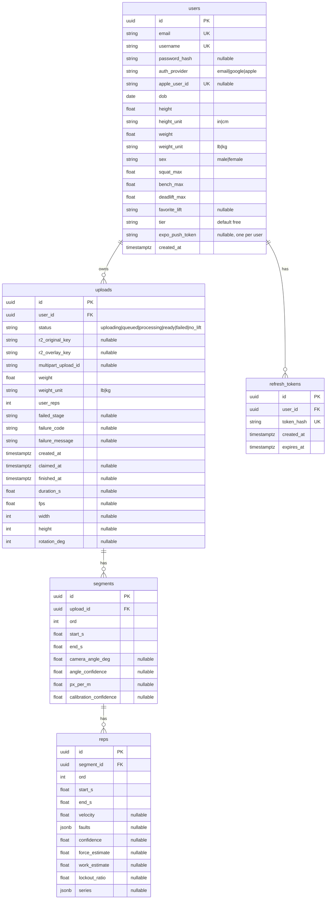

# ER — data model

Canonical schema for V1. Must match `backend/liftcam/core/models.py` column for column.

Indexes:

- `uploads (user_id, created_at DESC)` — History
- partial `uploads (status) WHERE status = 'queued'` — worker claim
- unique `(upload_id, ord)` on segments; unique `(segment_id, ord)` on reps
