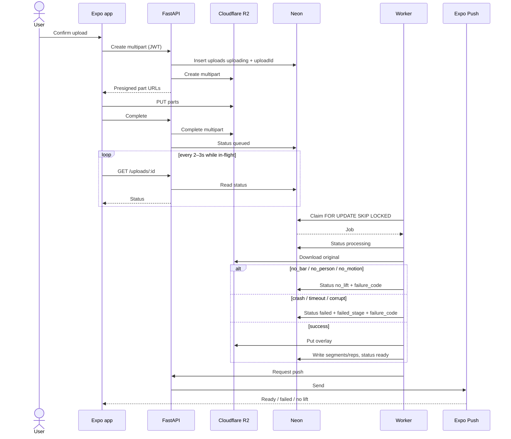

# Sequence — process job

```mermaid
sequenceDiagram
  actor User
  participant App as Expo app
  participant API as FastAPI
  participant R2 as Cloudflare R2
  participant PG as Neon
  participant W as Worker
  participant Push as Expo Push

  User->>App: Confirm upload
  App->>API: Create multipart (JWT)
  API->>PG: Insert uploads uploading + uploadId
  API->>R2: Create multipart
  API-->>App: Presigned part URLs
  App->>R2: PUT parts
  App->>API: Complete
  API->>R2: Complete multipart
  API->>PG: Status queued
  loop every 2–3s while in-flight
    App->>API: GET /uploads/:id
    API->>PG: Read status
    API-->>App: Status
  end
  W->>PG: Claim FOR UPDATE SKIP LOCKED
  PG-->>W: Job
  W->>PG: Status processing
  W->>R2: Download original
  alt no_bar / no_person / no_motion
    W->>PG: Status no_lift + failure_code
  else crash / timeout / corrupt
    W->>PG: Status failed + failed_stage + failure_code
  else success
    W->>R2: Put overlay
    W->>PG: Write segments/reps, status ready
  end
  W->>API: Request push
  API->>Push: Send
  Push-->>App: Ready / failed / no lift
```
