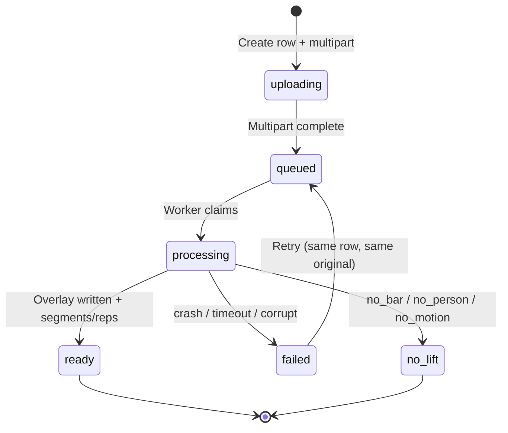

# State — job

```mermaid
stateDiagram-v2
  [*] --> uploading: Create row + multipart
  uploading --> queued: Multipart complete
  queued --> processing: Worker claims
  processing --> ready: Overlay written + segments/reps
  processing --> failed: crash / timeout / corrupt
  processing --> no_lift: no_bar / no_person / no_motion
  failed --> queued: Retry (same row, same original)
  ready --> [*]
  no_lift --> [*]
```
